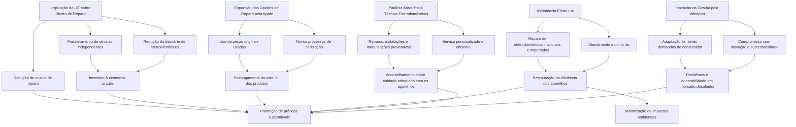

```mermaid
graph TD
    A[Legislação da UE sobre Direito de Reparo] --> B[Fortalecimento de oficinas independentes]
    A --> C[Redução do descarte de eletroeletrônicos]
    A --> D[Redução de custos de reparo]
    B --> E[Incentivo à economia circular]
    C --> E
    D --> F[Promoção de práticas sustentáveis]
    E --> F

    G[Expansão das Opções de Reparo pela Apple] --> H[Uso de peças originais usadas]
    G --> I[Novos processos de calibração]
    H --> J[Prolongamento da vida útil dos produtos]
    I --> J
    J --> F

    K[Assistência Eletro Lar] --> L[Reparo de eletrodomésticos nacionais e importados]
    K --> M[Atendimento a domicílio]
    L --> N[Restauração da eficiência dos aparelhos]
    M --> N
    N --> O[Minimização de impactos ambientais]
    N --> F

    P[Paulínia Assistência Técnica Eletrodomésticos] --> Q[Reparos, instalações e manutenções preventivas]
    P --> R[Serviço personalizado e eficiente]
    Q --> S[Aconselhamento sobre cuidado adequado com os aparelhos]
    R --> S
    S --> F

    T[Inovação na Gestão pela Whirlpool] --> U[Adaptação às novas demandas do consumidor]
    T --> V[Compromisso com inovação e sustentabilidade]
    U --> W[Resiliência e adaptabilidade em mercado desafiador]
    V --> W
    W --> F
```